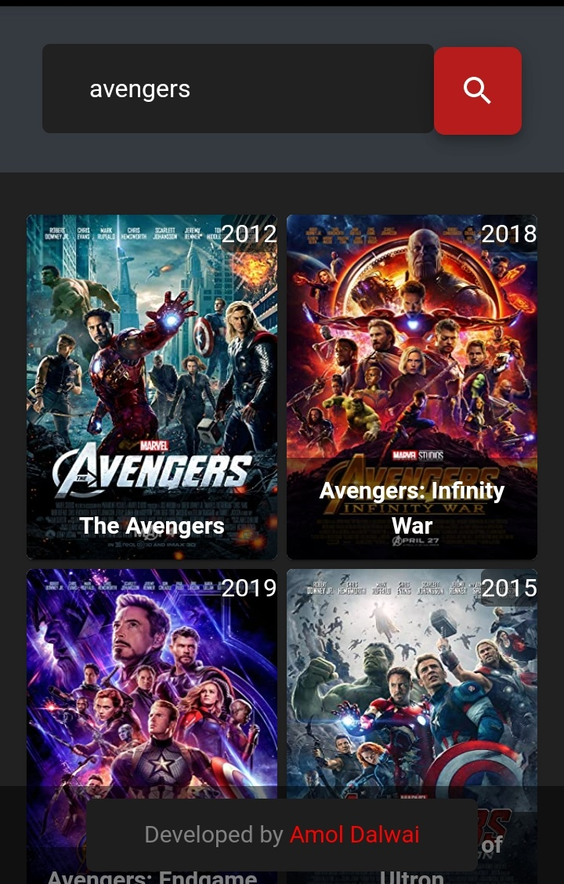
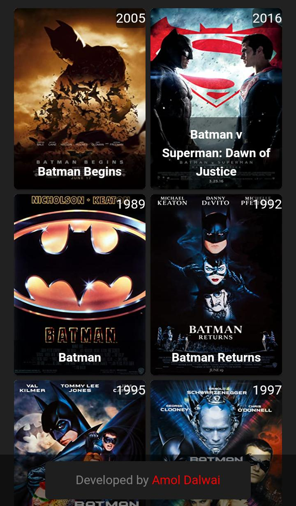
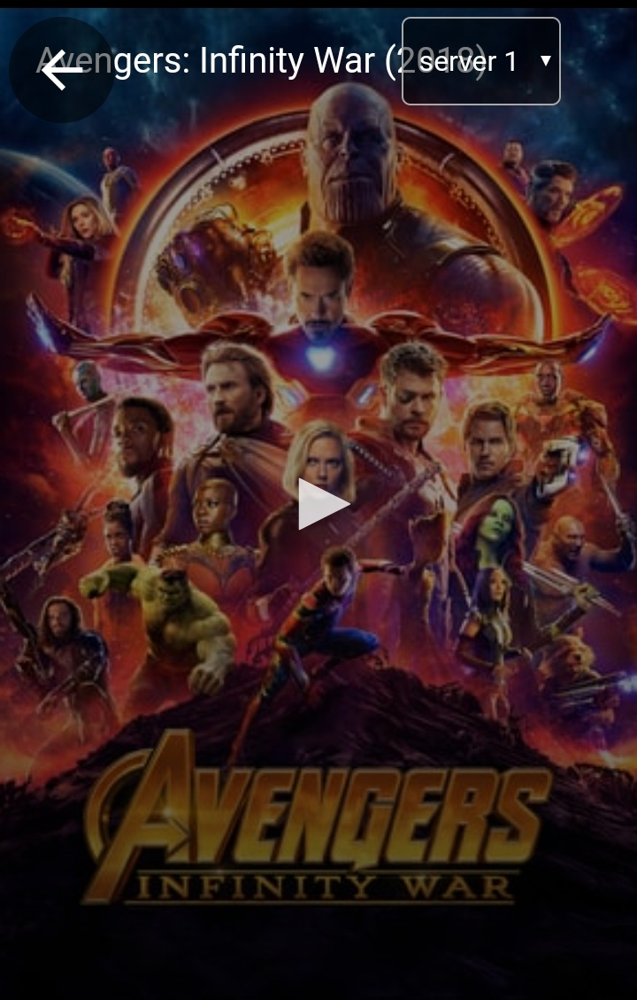
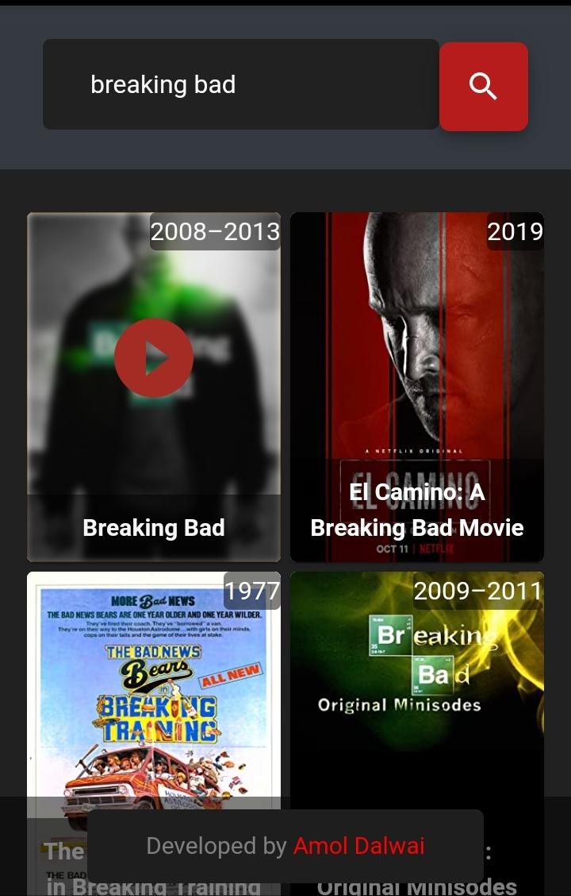
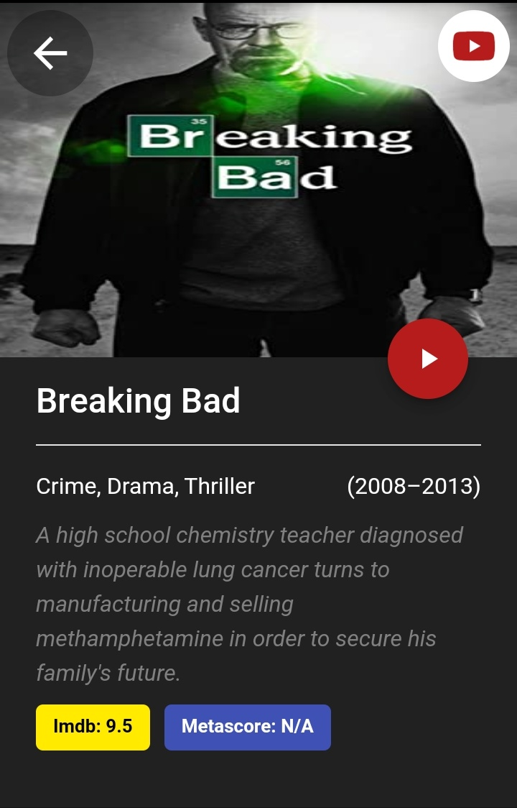

<p align="center">
  
  <h3 align="center">
    WatchAnyMovie
    <h6 align="center">
    by Amol Dalwai
    </h6>
  </h1>
  
  
</p>

A Netflix Clone App built using React js , Material UI & OMDb API that allows searching of 1000+ movies and provides information about their plot, IMDB rating, MetaScore, Genre, and Year in which it is published, along with high-quality audio and video streaming.

<p align="center">
 
 
 
</p>

## Table of Contents

[Features](#Features)  
[Youtube](#Youtube)\
[Installing](#Installing)\
[Dependancies](#Dependancies)


## Features

-  100000+ movies/series without Ads/Popups.
-  Plot , IMDB rating , MetaScore , Genre and Year information.
-  Trailer Supports for Movies/WebSeries.
-  Direct Movie/Webseries Links.
-  Multiple Servers/Torrent Links (4 Servers per movie).
-  Dedicated Video player with captions, Speed & Quality change (currently supports 720p).


## Youtube

<a href="http://www.youtube.com/watch?feature=player_embedded&v=Ij769z7UUPg
" target="_blank"></a>


## Dependancies

- [Material-UI](https://www.npmjs.com/package/@material-ui/core)
- [Bootstrap](https://www.npmjs.com/package/bootstrap)
- [Axios](https://www.npmjs.com/package/axios)
- [Ghpages](https://www.npmjs.com/package/ghpages)
- [YTS API](https://yts.mx/api)
- [OMDb](http://www.omdbapi.com/)
- [TMDb](https://www.themoviedb.org/)
- [Firebase tools](https://www.npmjs.com/package/firebase)


### Installing

```
npm start
```

Runs the app in the development mode.
Open http://localhost:3000 to view it in the browser.


